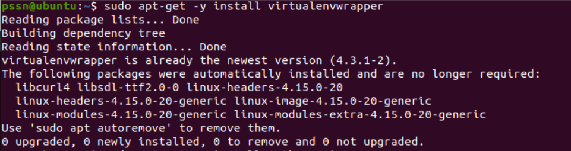

Instalasi
==========

(1) Instalansi Librari Python pada  Ubuntu/Debian
^^^^^^^^^^^^^^^^^^^^^^^^^^^^^^^^^^^^^^^^^^^^^^^^^^

1. Lakukan instalasi berikut ini:

.. code-block:: shell

   $ sudo apt-get install python python-pip python-dev libffi-dev libssl-dev

.. image:: a.png

.. code-block:: shell

   $ sudo apt-get install python-virtualenv python-setuptools

.. image:: b.png

.. code-block:: shell

   $ sudo apt-get install libjpeg-dev zlib1g-dev swig

.. image:: c.png

(2) Pembuatan Web Interface Cuckoo
^^^^^^^^^^^^^^^^^^^^^^^^^^^^^^^^^^^

1. Lakukan instalasi mongo-db dengan menggunakan perintah:

.. code-block:: shell

   $ sudo apt-get insttall mongo-db

2. Instalasi postgresql

.. code-block:: shell

   $ sudo apt-get insttall postgresql libpq-dev

.. image:: e.png

3. Instalasi apparmor tcpdump

.. code-block:: shell
  
   $ sudo apt-get install tcpdump apparmor-utils

.. image:: f.png

Tcpdump membutuhkan hak akses root, tetapi Cuckoo seharusnya tidak dijalankan sebagai root, lakukan pengaturan dengan:

.. code-block:: shell
  
   $ sudo groupadd pcap
   $ sudo usermod -a -G pcap cuckoo
   $ sudo chgrp pcap /usr/sbin/tcpdump
   $ sudo setcap cap_net_raw,cap_net_admin=eip /usr/sbin/tcpdump 

.. image:: g.png

4. Pengunduhan ISO Windows 7 dan proses mounting ISO, unduh ISO, buat folder dan mounting:

.. code-block:: shell

   $ wget https://cuckoo.sh/win7ultimate.iso
   $ mkdir /mnt/win7
   $ sudo mount -o ro,loop win7ultimate.iso /mnt/win7

(3) Instalasi dan Pengaturan Virtualbox
^^^^^^^^^^^^^^^^^^^^^^^^^^^^^^^^^^^^^^^^

1. Penambahan kunci repositori:

.. code-block:: shell

   $ wget -q https://www.virtualbox.org/download/oracle_vbox_2016.asc -O- | sudo apt-key add -
   $ wget -q https://www.virtualbox.org/download/oracle_vbox.asc -O- | sudo apt-key add -

.. image:: h.png

2. Penambahan repositori VirtualBox:

.. code-block:: shell

   $ sudo add-apt-repository "deb [arch=amd64] http://download.virtualbox.org/virtualbox/debian $(lsb_release -cs) contrib"

3. Instalasi VirtualBox 5.2:

.. code-block:: shell

   $ sudo apt-get install virtualbox-5.2

.. image:: j.png

4. Instalasi M2Crypto:

.. code-block:: shell

   $ sudo pip install m2crypto

(4) Instalasi dan Pengaturan Cuckoo-Virtualvenv.sh
^^^^^^^^^^^^^^^^^^^^^^^^^^^^^^^^^^^^^^^^^^^^^^^^^^^

1. Install virtualenv:

.. code-block:: shell

   $ sudo apt-get update && sudo apt-get -y install virtualenv

.. image:: l.png

2. Install virtualenvwrapper:

.. code-block:: shell

   $ sudo apt-get -y install virtualenvwrapper                                 

3. Install pip for python3:

.. code-block:: shell

   $ sudo apt-get -y install python3-pip

.. image:: n.png

4. pip3 install --user virtualenvwrapper:

.. code-block:: shell

   $ echo "export VIRTUALENVWRAPPER_PYTHON=/usr/bin/python3" >> ~/.bashrc
   $ echo "source ~/.local/bin/virtualenvwrapper.sh" >> ~/.bashrc
   $ export WORKON_HOME=~/.virtualenvs
   $ echo "export WORKON_HOME=~/.virtualenvs" >> ~/.bashrc
   $ echo "export PIP_VIRTUALENV_BASE=~/.virtualenvs" >> ~/.bashrc 
   $ source ~/.bashrc

(5) Instalasi Cuckoo dan VM Cloack
^^^^^^^^^^^^^^^^^^^^^^^^^^^^^^^^^^

1. Masuk direktori cuckoo:

.. code-block:: shell

   $ cd ..
   $ cd cuckoo
   $ virtualenv -p python2.7 cuckoo-test
   $ . cuckoo-test/bin/activate

.. image:: p.png

2. Install VM Cloack:

.. code-block:: shell

   $ pip install -U cuckoo vmcloak

.. image:: q.png

3. Instal pip setup tools:

.. code-block:: shell

   $ pip install -U pip setuptools
   
.. image:: r.png

4. Instalasi kebutuhan VM Cloack dan Cuckoo:

.. code-block:: shell

   $ sudo apt-get -y install build-essential libssl-dev libffi-dev python-dev genisoimage

.. code-block:: shell

   $ sudo apt-get -y install zlib1g-dev libjpeg-dev

.. image:: t.png

.. code-block:: shell

   $ sudo apt-get -y install python-pip python-virtualenv python-setuptools swig
   
.. image:: u.png

(6) Automatic VM Creation
^^^^^^^^^^^^^^^^^^^^^^^^^^

1. Pertama, mulailah dengan mendefinisikan dan membuat instance adapter jaringan Host-Only VirtualBox untuk digunakan VM:

.. code-block:: shell

   $ vmcloak-vboxnet0

2. Cek interface dengan menggunakan perintah:

.. code-block:: shell

   $ ifconfig 

3. Kemudian membuat VM dan menginstal Windows secara otomatis, Cuckoo VM setidaknya memiliki 2GB memori dan dua atau lebih core CPU:

.. code-block:: shell

   $ vmcloak init --verbose --win7x64 win7x64base --cpus 2 --ramsize 2048        

.. image:: x.png

4. Membuat kloning dan snapshot dari VM:

.. code-block:: shell

   $ vmcloak clone win7x64base win7x64cuckoo

.. image:: y.png

5. Lakukan instalasi vmcloack dengan Internet Explorer 11:

.. code-block:: shell

   $ vmcloak install win7x64cuckoo ie11

.. image:: z.png

6. Instalasi snapshot untuk VM dengan ip yang digunakan:

.. code-block:: shell

   $ vmcloak snapshot --count 4 win7x64cuckoo 192.168.56.101     

(7) Konfigurasi Cuckoo
^^^^^^^^^^^^^^^^^^^^^^^

1. Pembuatan direktori dengan perintah:

.. code-block:: shell

   $ cuckoo init

2. Masuk pada direktori cuckoo dan lihat isi direktori tersebut dengan perintah:

.. code-block:: shell

   $ cd .cuckoo/
   $ ls     

3. Konfigurasi cuckoo community: 

.. code-block:: shell

   $ cuckoo community     

.. image:: z13.png

4. Konfigurasi file virtualbox.conf:

Gambar di bawah menunjukan file konfigurasi virtualbox.conf sebelum dilakukan perubahan

.. code-block:: shell

   $ nano virtualbox.conf

5.Tambahkan ip pada file konfigurasi virtualbox.conf:

.. code-block:: shell

   $ while read -r vm ip; do cuckoo machine --add $vm $ip; done < <(vmcloak list vms)
   $ nano virtualbox.conf

6. Setelah ditambahkan konfigurasi akan berubah menjadi:

.. image:: z16.png

(8) Pengaturan Jaringan dan Konfigurasi Routing 
^^^^^^^^^^^^^^^^^^^^^^^^^^^^^^^^^^^^^^^^^^^^^^^^

1. Sebagai root, terapkan pada interface vboxnet0 dan interface keluar, penggunaan enss33 sebagai nilai dummy:

.. code-block:: shell

   $ sudo sysctl -w net.ipv4.conf.vboxnet0.forwarding=1
   $ sudo sysctl -w net.ipv4.conf.ens33.forwarding=1

2. Konfigurasi pada file routing.conf, dengan mengubah interface yang digunakan oleh filter yaitu ens33:

.. code-block:: shell

   $ sudo nano routing.conf

.. image:: z18.png

3. Lakukan konfigurasi file reporting.conf pada bagian “ [mongodb]” pada baris “enabled = yes”:

.. code-block:: shell

   $ sudo nano reporting.conf

.. image:: z19.png

4. Menciptakan proses cuckoo router dengan tidak menjalankannya menggunakan perintah sudo:

.. code-block:: shell

   $ cuckoo rooter --sudo --group pssn

.. image:: z20.png

5. Menjalankan cuckoo web dengan server:

.. code-block:: shell

   $ cuckoo web --host 0.0.0.0 --port 8080

.. image:: z21.png

(9) Menjalankan Cuckoo
^^^^^^^^^^^^^^^^^^^^^^^

1. Setelah proses sebelumnya berhasil dilakukan, kemudian uji coba cuckoo dengan perintah:

.. code-block:: shell

   $ cuckoo

2. Pada saat menjalankan cuckoo akan membutuhkan 3 tab terminal yang akan dijalankan secara bersamaan.
Pada terminal pertama gunakan perintah berikut ini:

.. code-block:: shell

   $ cuckoo rooter --sudo --group pssn

.. image:: z25.png

3. Pada terminal kedua akan dijalankan dengan perintah dengan tujuan unutk mengakses ke media web server:

.. code-block:: shell

   $ virtualenv -p python2.7 cuckoo-test
   $ . cuckoo-test/bin/activate

.. image:: z24.png

4. Cara akses ke media web browser dengan membuka terminal baru (terminal ketiga) untuk melakukan ssh ke server.
Jalankan perintah berikut terlebih dahulu pada tab ketiga:

.. code-block:: shell

   $ cuckoo web --host 0.0.0.0 --port 8080
   $ cuckoo

.. image:: z26.png

4. Pembuatan web interface dan mengakses di web browser dengan alamat IP 103.206.253.179:8080:

