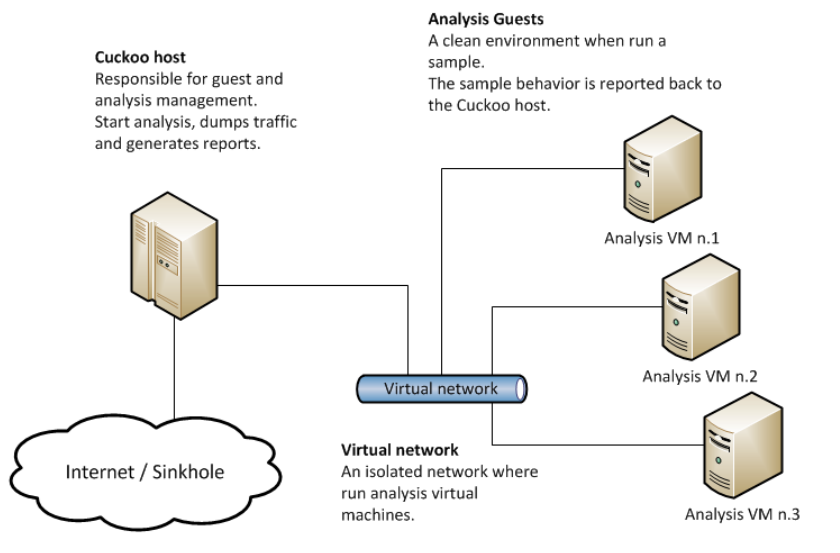

Pengenalan
===========

Cuckoo Sandbox
^^^^^^^^^^^^^^^

Cuckoo Sandbox adalah sistem analisis malware otomatis yang bersifat open source dengan menggunakan tampilan antarmuka (interface) artinya dapat dilakukan perubahan dari pihak pengguna seperti penambahan-penambahan fitur maupun melakukan perubahan dari segi lainnya.

Cara kerjanya cukup sederhana dengan melakukan penempatan atau drop file yang mencurigakan pada cuckoo dan dalam beberapa menit Cuckoo akan memberikan laporan terperinci yang menguraikan perilaku file ketika dieksekusi di dalam lingkungan yang realistis tetapi terisolasi, artinya informasi-informasi yang merujuk pada identitas file akan dapat diketahui secara menyeluruh dan kelebihannya sistem yang bekerja bukan dari perangkat pada Host secara langsung sehingga meminimalisir jika terjadi kerusakan-kerusakan yang akan ditimbulkan akibat aktivitas dalam melakukan analisis malware atau melakukan eksekusi file yang dicurigai sebagai malware hal ini sesuai dengan yang dijelaskan pada halaman resmi cuckoo sandbox yaitu https://cuckoosandbox.org/.

Sejarah Terciptanya Cuckoo Sandbox
^^^^^^^^^^^^^^^^^^^^^^^^^^^^^^^^^^^

Sebuah program tidak secara tiba-tiba muncul dan dapat dimanfaatkan oleh banyak pengguna, pasti ada latar belakang dan seluk beluk bagaimana suatu program itu dirancang dan dikemabangkan. Begitu pula dengan Cuckoo Sandbox.

Pada awalnya, Cuckoo Sandbox dimulai sebagai proyek Google Summer of Code pada 2010 di dalam The Honeynet Project yang mulanya dirancang dan dikembangkan oleh Claudio "nex" Guarnieri, yang masih menjadi pemimpin proyek dan pengembang inti.
Pekerjaan awal berlangsung selama musim panas 2010 telah dikerjakan, hasilnya adalah rilis beta pertama yang diterbitkan pada 5 Februari 2011, ketika Cuckoo diumumkan dan didistribusikan secara publik untuk pertama kalinya.

Pada bulan Maret 2011, Cuckoo telah dipilih kembali sebagai proyek yang didukung selama Google Summer of Code 2011 dengan The Honeynet Project, di mana Dario Fernandes bergabung dengan proyek dan memperluas fungsinya.
Pada 2 November 2011, Cuckoo merilis versi 0.2nya ke publik sebagai rilis stabil nyata pertama. Pada akhir November 2011 Alessandro "jekil" Tanasi bergabung dengan tim yang memperluas fungsionalitas pemrosesan dan pelaporan Cuckoo.

Pada Desember 2011 Cuckoo v0.3 dirilis dan dengan cepat hits rilis 0.3.2 di awal Februari. Pada akhir Januari 2012 mereka membuka Malwr.com, instance Cuckoo Sandbox yang dijalankan secara publik dan disediakan dengan antarmuka lengkap yang melaluinya orang dapat mengirimkan file untuk dianalisis dan mendapatkan hasil kembali.

Pada Maret 2012 Cuckoo Sandbox memenangkan putaran pertama program
Magnificent7 yang diselenggarakan oleh Rapid7. Selama Musim Panas 2012, "pemain ski" Juryer, Bremer bergabung dengan tim pengembangan, merefactoring komponen analisis Windows secara masuk akal meningkatkan kualitas analisis.

Pada 24 Juli 2012, Cuckoo Sandbox 0.4 dirilis. Berangsur pada 20 Desember 2012, Cuckoo Sandbox 0.5 "To The End Of The World" dirilis. Pada 15 April 2013 kami merilis Cuckoo Sandbox 0.6, tak lama setelah meluncurkan versi kedua Malwr.com.

Pada 1 Agustus 2013 Claudio "nex" Guarnieri, Jurriaan "pemain ski" Bremer dan Mark "rep" Schloesser mempresentasikan Masalah Mo 'Malware Mo' - Cuckoo Sandbox untuk penyelamatan di Black Hat Las Vegas. Pada 9 Januari 2014, Cuckoo Sandbox 1.0 dirilis.

Pada bulan Maret 2014 Cuckoo Foundation lahir sebagai organisasi nirlaba yang didedikasikan untuk pertumbuhan Cuckoo Sandbox dan proyek serta inisiatif di sekitarnya.

Pada 7 April 2014, Cuckoo Sandbox 1.1 dirilis. Pada tanggal 7 Oktober 2014, Cuckoo Sandbox 1.1.1 dirilis setelah Critical Vulnerability diungkapkan oleh Robert Michel.

Pada tanggal 4 Maret 2015, Cuckoo Sandbox 1.2 telah dirilis menampilkan beragam perbaikan mengenai kegunaan Cuckoo. Selama musim panas 2015 Cuckoo Sandbox memulai pengembangan analisis malware Mac OS X sebagai proyek Google Summer of Code dalam The Honeynet Project. Dmitry Rodionov memenuhi syarat untuk proyek ini dan mengembangkan alat analisa untuk Mac OS X.

Pada 21 Februari 2016 versi 2.0 Release Candidate 1 dirilis. Versi ini dikirimkan dengan hampir dua tahun upaya gabungan untuk menjadikan Cuckoo Sandbox proyek yang lebih baik untuk penggunaan sehari-hari.

Arsitektur Cuckoo Sandbox
^^^^^^^^^^^^^^^^^^^^^^^^^^

Cuckoo Sandbox terdiri dari perangkat lunak manajemen pusat yang menangani eksekusi sampel dan analisis sesuai dengan sumber asli dokumentasi dari cuckoo yaitu https://docs.cuckoosandbox.org/en/latest/. Setiap analisis diluncurkan dalam mesin virtual atau fisik yang segar dan terisolasi. Komponen utama infrastruktur Cuckoo adalah mesin Host (perangkat lunak manajemen) dan sejumlah mesin Tamu (mesin virtual atau fisik untuk analisis). Host menjalankan komponen inti dari Sandbox yang mengelola seluruh proses analisis, sementara Pengguna yang datang adalah lingkungan yang terisolasi di mana sampel malware benar-benar dieksekusi dan dianalisis dengan aman.

Cara Kerja Cuckoo Sandbox
^^^^^^^^^^^^^^^^^^^^^^^^^^

Cuckoo Sandbox adalah sistem analisis malware otomatis open source yang canggih, sangat modular, dan 100% dengan peluang aplikasi tanpa batas. Secara default dapat:

1) Menganalisis banyak file berbahaya yang berbeda (dapat dieksekusi, dokumen kantor, file pdf, email, dll) serta situs web berbahaya di Windows, Linux, macOS, dan lingkungan tervirtualisasi Android.

2) Melacak panggilan API dan perilaku umum file dan saring menjadi informasi dan tanda tangan tingkat tinggi yang dapat dipahami oleh siapa pun.

3) Membuang dan analisis lalu lintas jaringan, bahkan ketika dienkripsi dengan SSL / TLS. Dengan dukungan perutean jaringan asli untuk menjatuhkan semua lalu lintas atau merutekannya melalui InetSIM, antarmuka jaringan, atau VPN.

4) Melakukan analisis memori tingkat lanjut dari sistem tervirtualisasi yang terinfeksi melalui Volatilitas serta pada granularity memori proses menggunakan YARA. Karena sifat open source Cuckoo dan desain modular yang luas, orang dapat menyesuaikan aspek lingkungan analisis, pemrosesan hasil analisis, dan tahap pelaporan. Cuckoo memberi pengguna semua persyaratan untuk dengan mudah mengintegrasikan sandbox ke dalam kerangka kerja yang ada dan membuat backend seperti yang pengguna inginkan, dengan format yang pengguna inginkan, dan semua itu tanpa persyaratan lisensi.

