Penggunaan
===========

Input Sample
^^^^^^^^^^^^^^^

Sebelum menerapkan Cuckoo Sandbox sebagai analisis malware, terlebih dahulu jalankan cuckoo seperti pada proses instalasi.

1. Akses web interface cuckoo di web browser dengan alamat IP 103.206.253.179:8080:

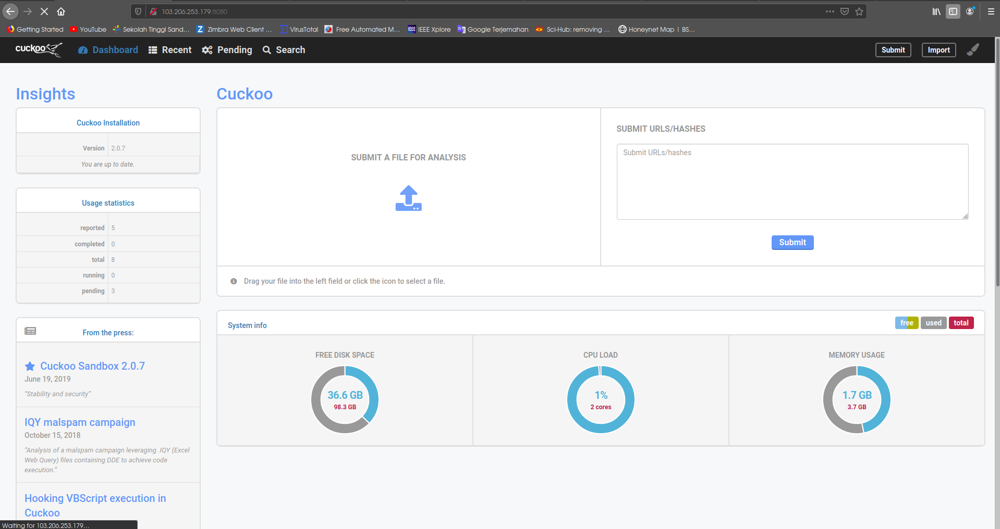

2. Kemudian pengambilan data pada Dionaea atau sample data yang akan dianalisis, pada percobaan ini dilakukan pengambilan data dengan sumber data pada kelompok1 dengan menggunakan perintah scp untuk menyalin file dan meletakkan pada direktori yang sesuai:

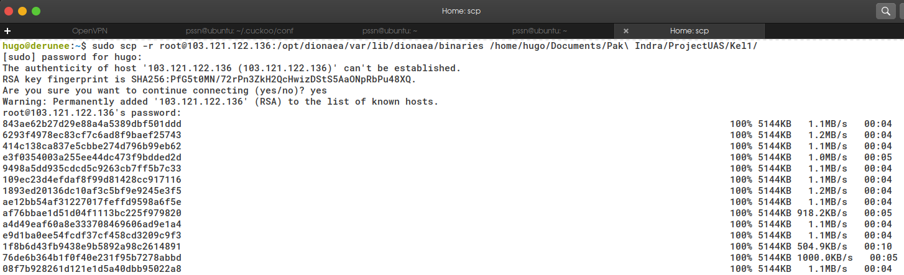

3. Pengambilan dilakukan juga data pada Cowrie. Kemudian, masukkan file yang sudah didapatkan ke dalam cuckoo:

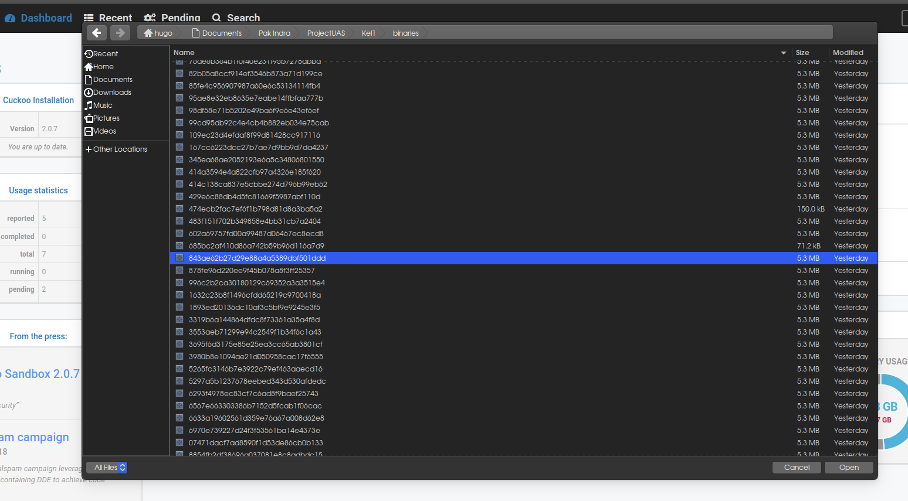

Analisis Sample
^^^^^^^^^^^^^^^^

1. Pada gambar dibawah ini menunjukkan jika berhasil melakukan input sample untuk dianalisis pada cuckoo:

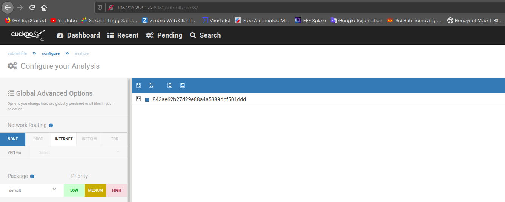

2. Melakukan proses analisis, jika akan melakukan analisis akan masuk pada daftar Tasks dengan pemberian ID sebagai inisial dengan keterangan detail lainnya, seperti pada gambar:

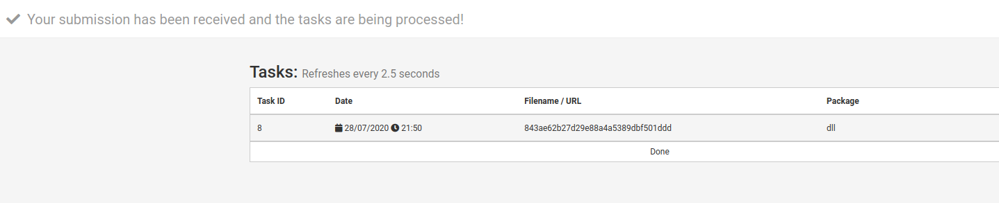

3. Melihat daftar file sebagai hasil analisis yang sudah diinputkan akan ditampilkan pada tampilan display Recent pada cuckoo:

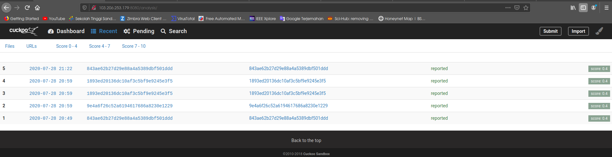

4. Hal yang lebih menarik adalah pada cuckoo diberikan hasil dengan mengetahui detail file pada bagian Summary yang memuat informasi terkait file, pada bagian kiri cuckoo akan menyajikan fitur analisis terhadap file:

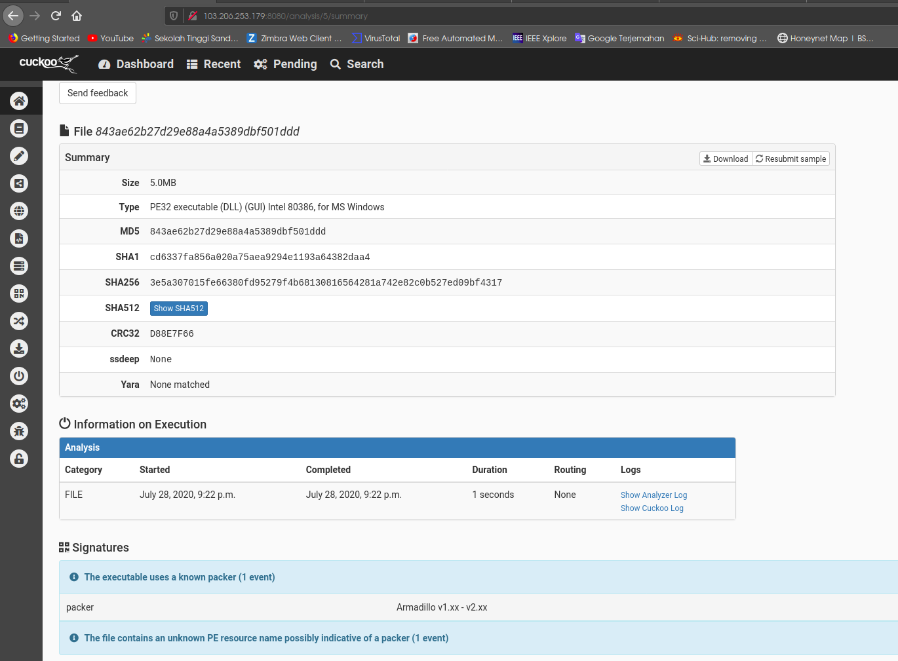

Tampilan bagian kiri cuckoo (fitur analisis detail terhadap file):

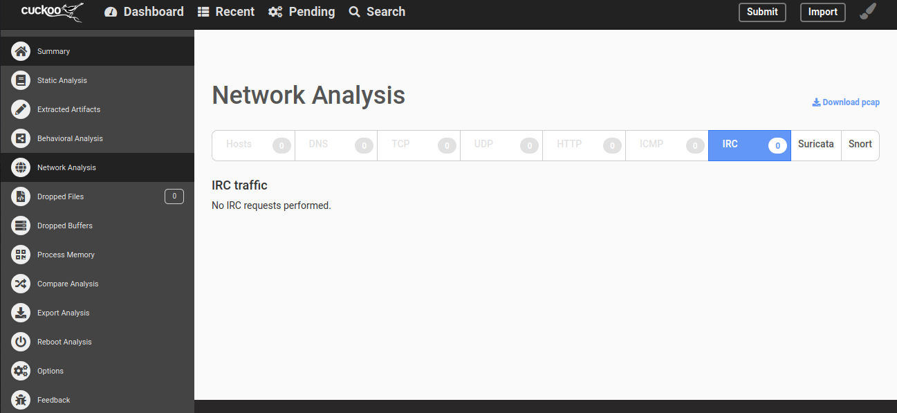

5. Kemudian dapat dilakukan Static Analysis:

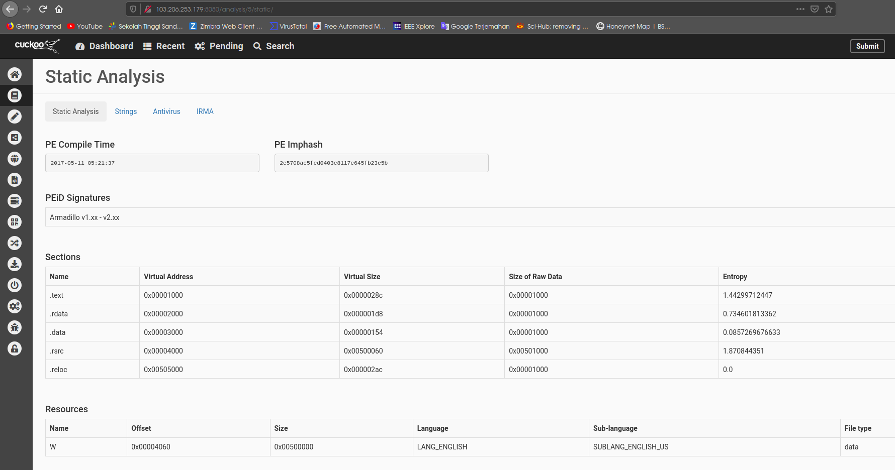

tampilan lain pada Static Analysis:

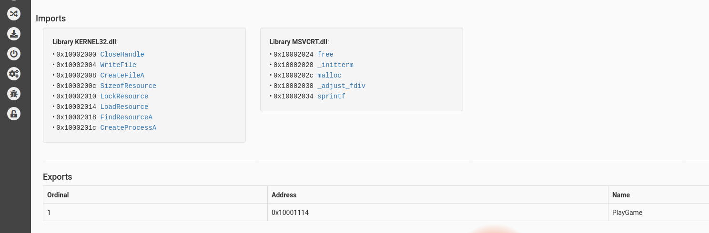

6. Melihat file sample yang input dengan menggunakan Behavioral Analysis:

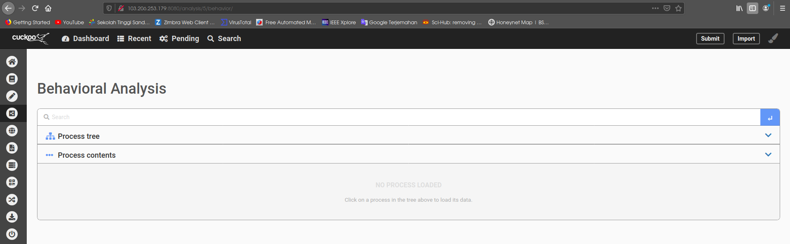

7. Dropped Files:

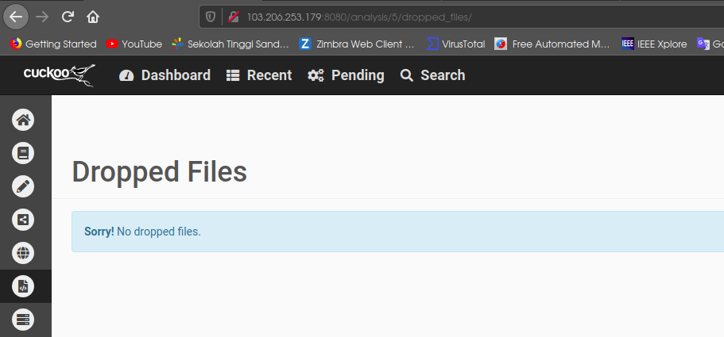

Dropped Buffers:

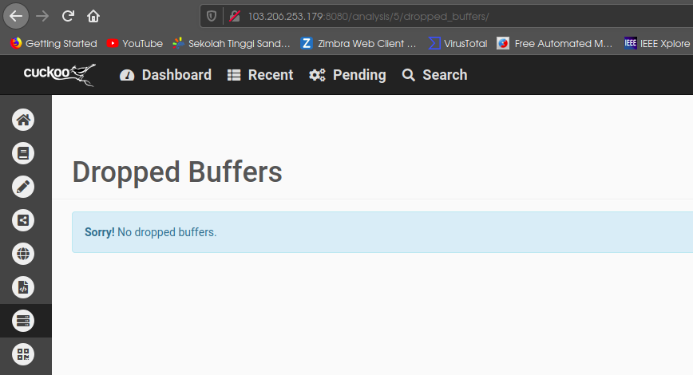

8. Process Memory:

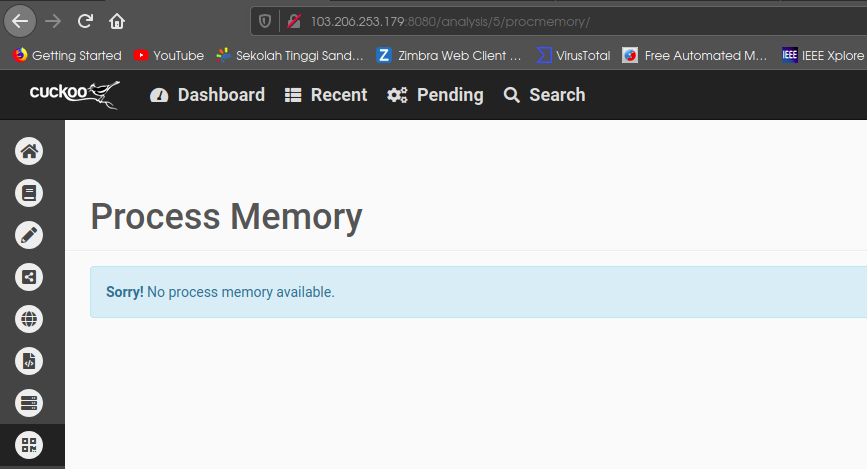

9. Melakukan perbandingan dengan fitur Compare:

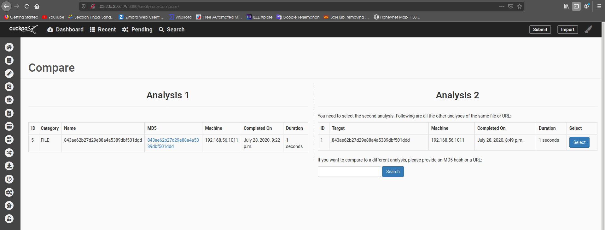

