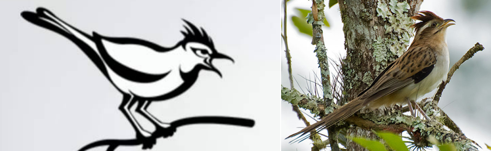

.. cuckooblue documentation master file, created by
   sphinx-quickstart on Sun Jul 26 11:16:19 2020.
   You can adapt this file completely to your liking, but it should at least
   contain the root `toctree` directive.

Cuckoo Sandbox Analisis Malware
=================================

Kelompok 2 - RKSBlue
^^^^^^^^^^^^^^^^^^^^^^

.. code-block:: shell
   
    Disusun oleh:
    
    Dedek Wahyu Avyansyah
    Fajar Sofar
    Gifni Hammam Muyasar Permadi
    Muhammad Jamil Daulima
    Tiara Anggita Yudhistira

.. toctree::
   :maxdepth: 2
   :caption: Daftar isi:

   coba/Pengenalan/pengenalan
   coba/Instalasi/instalasi
   coba/Penggunaan/penggunaan
   coba/Pengembangan/pengembangan
   coba/Catatan/catatan

Index dan Tabel
==================

* :ref:`genindex`
* :ref:`modindex`
* :ref:`search`
